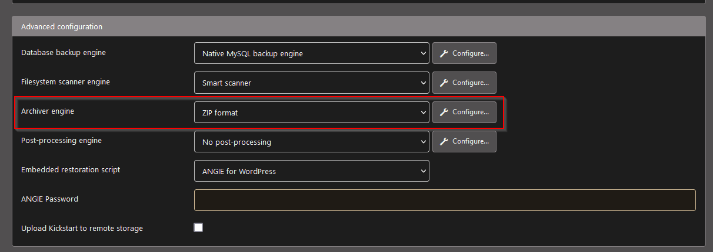

<!-- PROJECT LOGO -->
<br />
<div align="center">
  <a href="https://enclaive.io/products/">
    
  </a>

  <h2 align="center">WORDPRESS-SGX: SGX-ready WordPress Confidential Container</h2>

  <p align="center">
    <h3>packed by <a href="https://enclaive.io">enclaive</a></h3>
    </br>
    #intelsgx #confidentialcompute #zeorotrust #cloud
    <br />
    <a href="#contributing">Contribute</a>
    ·
    <a href="https://github.com/enclaive/enclaive-docker-wordpress-sgx/issues">Report Bug</a>
    ·
    <a href="https://github.com/enclaive/enclaive-docker-wordpress-sgx/issues">Request Feature</a>
  </p>
</div>

## TL;DR

```sh
cp .env.example .env
# edit .env
docker-compose up
```
**Warning:** This quick setup is only intended for development environments. You are encouraged to change the insecure default credentials and check out the available configuration options in the build section for a more secure deployment.

<!-- INTRODCUTION -->
## What is Wordpress?

> WordPress (WP, WordPress.org) is a free and open-source content management system (CMS) written in PHP[4] and paired with a MySQL or MariaDB database. Features include a plugin architecture and a template system, referred to within WordPress as Themes. WordPress was originally created as a blog-publishing system but has evolved to support other web content types including more traditional mailing lists and forums, media galleries, membership sites, learning management systems (LMS) and online stores. One of the most popular content management system solutions in use, WordPress is used by 42.8% of the top 10 million websites as of October 2021.

[Overview of Wordpress](https://wordpress.com/)

> Intel Security Guard Extension (SGX) delivers advanced hardware and RAM security encryption features, so called enclaves, in order to isolate code and data that are specific to each application. When data and application code run in an enclave additional security, privacy and trust guarantees are given, making the container an ideal choice for (untrusted) cloud environments.

[Overview of Intel SGX](https://www.intel.com/content/www/us/en/developer/tools/software-guard-extensions/overview.html)

Application code executing within an Intel SGX enclave:

- Remains protected even when the BIOS, VMM, OS, and drivers are compromised, implying that an attacker with full execution control over the platform can be kept at bay
- Benefits from memory protections that thwart memory bus snooping, memory tampering and “cold boot” attacks on images retained in RAM
- At no moment in time data, program code and protocol messages are leaked or de-anonymized
- Reduces the trusted computing base of its parent application to the smallest possible footprint

<!-- WHY -->
## Why use WORDPRESS-SGX (instead of "vanilla" Wordpress) images?
Following benefits come for free with WORDPRESS-SGX :

- WordPress-SGX provides a significantly reduced attack surface thanks to hardware-based memory protection. At any moment in time, the microservices in the confindential containers processing the data, storing data in the SQL database and forwarding the data to other microservices are protected. Neither enclaive nor the hosting provider can inspect the data.
- Hardened security against kernel-space exploits, malicious and accidental privilege [insider](https://www.ibm.com/topics/insider-threats) attacks, [UEFI firmware](https://thehackernews.com/2022/02/dozens-of-security-flaws-discovered-in.html) exploits and other "root" attacks using the corruption of the application to infiltrate your network and system
- Run on any hosting environment irrespectivably of geo-location and comply with privacy export regulation, such as [Schrems-II](https://www.europarl.europa.eu/RegData/etudes/ATAG/2020/652073/EPRS_ATA(2020)652073_EN.pdf)
- GDPR/CCPA compliant processing ("data in use") of user data in the cloud as data is anonymized thanks to the enclave
- Last, but not least  "Small step for a dev, giant leap for a zero-trust infrastructure"


<!-- DEPLOY IN THE CLOUD -->
## How to deploy WORDPRESS-SGX in a zero-trust cloud?

The following cloud infrastractures are SGX-ready out of the box
* [Microsoft Azure Confidential Cloud](https://azure.microsoft.com/en-us/solutions/confidential-compute/) 
* [OVH Cloud](https://docs.ovh.com/ie/en/dedicated/enable-and-use-intel-sgx/)
* [Alibaba Cloud](https://www.alibabacloud.com/blog/alibaba-cloud-released-industrys-first-trusted-and-virtualized-instance-with-support-for-sgx-2-0-and-tpm_596821) 

Confidential compute is a fast growing space. Cloud providers continiously add confidential compute capabilities to their portfolio. Please [contact](#contact) us if the infrastracture provider of your preferred choice is missing.

<!-- GETTING STARTED -->
## Getting started
### Platform requirements

Check for *Intel Security Guard Extension (SGX)* presence by running the following
```
grep sgx /proc/cpuinfo
```
Alternatively have a thorough look at Intel's [processor list](https://www.intel.com/content/www/us/en/support/articles/000028173/processors.html). (We remark that macbooks with CPUs transitioned to Intel are unlikely supported. If you find a configuration, please [contact](#contact) us know.)

Note that in addition to SGX the hardware module must support FSGSBASE. FSGSBASE is an architecture extension that allows applications to directly write to the FS and GS segment registers. This allows fast switching to different threads in user applications, as well as providing an additional address register for application use. If your kernel version is 5.9 or higher, then the FSGSBASE feature is already supported and you can skip this step.

There are several options to proceed
* If: No SGX-ready hardware </br> 
[Azure Confidential Compute](https://azure.microsoft.com/en-us/solutions/confidential-compute/") cloud offers VMs with SGX support. Prices are fair and have been recently reduced to support the [developer community](https://azure.microsoft.com/en-us/updates/announcing-price-reductions-for-azure-confidential-computing/). First-time users get $200 USD [free](https://azure.microsoft.com/en-us/free/) credit. Other cloud provider like [OVH](https://docs.ovh.com/ie/en/dedicated/enable-and-use-intel-sgx/) or [Alibaba](https://www.alibabacloud.com/blog/alibaba-cloud-released-industrys-first-trusted-and-virtualized-instance-with-support-for-sgx-2-0-and-tpm_596821) cloud have similar offerings.
* Elif: Virtualization <br>
  Ubuntu 21.04 (Kernel 5.11) provides the driver off-the-shelf. Read the [release](https://ubuntu.com/blog/whats-new-in-security-for-ubuntu-21-04). Go to [download](https://ubuntu.com/download/desktop) page.
* Elif: Kernel 5.9 or higher <br>
Install the DCAP drivers from the Intel SGX [repo](https://github.com/intel/linux-sgx-driver)

  ```sh
  sudo apt update
  sudo apt -y install dkms
  wget https://download.01.org/intel-sgx/sgx-linux/2.13.3/linux/distro/ubuntu20.04-server/sgx_linux_x64_driver_1.41.bin -O sgx_linux_x64_driver.bin
  chmod +x sgx_linux_x64_driver.bin
  sudo ./sgx_linux_x64_driver.bin

  sudo apt -y install clang-10 libssl-dev gdb libsgx-enclave-common libsgx-quote-ex libprotobuf17 libsgx-dcap-ql libsgx-dcap-ql-dev az-dcap-client open-enclave
  ```

* Else: Kernel older than version 5.9 </br>
  Upgrade to Kernel 5.11 or higher. Follow the instructions [here](https://ubuntuhandbook.org/index.php/2021/02/linux-kernel-5-11released-install-ubuntu-linux-mint/).   

<!-- GET THIS IMAGE -->
### Get this image

The recommended way to get the enclaive WORDPRESS-SGX Open Source Docker Image is to pull the prebuilt image from the [Docker Hub Registry](https://hub.docker.com/r/enclaive/wordpress-sgx).

```console
docker pull enclaive/wordpress-sgx:latest
```

To use a specific version, you can pull a versioned tag. You can view the
[list of available versions](https://hub.docker.com/r/enclaive/wordpress-sgx/tags/)
in the Docker Hub Registry.

```console
docker pull enclaive/wordpress-sgx:[TAG]
```

<!-- BUILD THE IMAGE -->
## Build the image
If you wish, you can also build the image yourself.

```console
docker build -t enclaive/wordpress-sgx:latest 'https://github.com/enclaive/enclaive-docker-wordpress-sgx.git#master'
```

<!-- Import existing page -->
## Import existing page/Backup

**Important:** WordPress-SGX runs in an enclave turning the application into an in-memory, fully encrypted process. Persistance is thus not guaranteed. Any changes made through the WordPress admin interface are lost when the enclave is stopped. For production usage we strongly advise to take additional measures to keep track of changes, be it through a CI/CD pipeline or be it thorugh the in-build Akeeba backup plugin.

### Staging/production CI/CD pipeline
Build a non-enclaved staging pipeline where changes are persistance. Build a production pipeline with the state changes, build and deploy the enclaved production version.

### Akeeba Plugin

The [Akeeba plugin](https://www.akeeba.com/) helps to backup and restore a WordPress site including the database. This makes the migration from WordPress to WordPress-SGX as easy as possible, if you are not familiar with pipelines.

Please visit [Akeeba download site](https://www.akeeba.com/products/akeeba-backup-wordpress.html) and install the plugin to your current WP instance. Akeeba provides [documentation](https://www.akeeba.com/documentation/akeeba-solo/installing-wordpress.html) and a [video tutorial](https://www.youtube.com/watch?v=VneMbQ2g26Y&list=PLU28ZwI9FpHbM-CDBGnIemq17qefQob8V) on youtube. 

To transfer your website into the WORDPRESS-SGX instance, follow these instructions: 

Before you create a backup you need to change the type of the backup file. At the current development state, WORDPRESS-SGX supports zip files only. Change the default `jpa` file type to `zip` in the configuration. Click on Akeeba Backup in the navigation tree in the admin page. Click on the Configuration Button in the Main Operations block. Search for Archiver Engine and choose ZIP format. Don’t forget to scroll up to save your change. Please don’t set a password for the backup file. 



Next create a backup file by clicking on the Backup Now button. When the backup is done click on the Manage Backups button. Download the backup file and rename it to `backup.zip`. 

Move the `backup.zip` file into the root folder of this git repository and run the command `docker-compose up`. After the docker is up and running you can visit your page in the browser and explore your page on a enclaved docker container. 

<!-- CONTRIBUTING -->
## Contributing

Contributions are what make the open source community such an amazing place to learn, inspire, and create. Any contributions you make are **greatly appreciated**. If you have a suggestion that would make this better, please fork the repo and create a pull request. You can also simply open an issue with the tag "enhancement".

1. Fork the Project
2. Create your Feature Branch (`git checkout -b feature/AmazingFeature`)
3. Commit your Changes (`git commit -m 'Add some AmazingFeature'`)
4. Push to the Branch (`git push origin feature/AmazingFeature`)
5. Open a Pull Request

<!-- SUPPORT -->
## Support

Don't forget to give the project a star! Spread the word on social media! Thanks again!

<!-- LICENSE -->
## License

Distributed under the Apache License 2.0 License. See `LICENSE` for more information.

<!-- CONTACT -->
## Contact

enclaive.io - [@enclaive_io](https://twitter.com/enclaive_io) - contact@enclaive.io - [https://enclaive.io](https://enclaive.io)

<!-- ACKNOWLEDGMENTS -->
## Acknowledgments

This project greatly celebrates all contributions from the open source community. Special shout out to [Dmitrii Kuvaiskii](https://github.com/dimakuv) from Intel/gramine project and the EdgelessDB team for their support. 

* [Gramine Project](https://github.com/gramineproject)
* [Intel SGX](https://github.com/intel/linux-sgx-driver)
* [EdgelessDB](https://github.com/edgelesssys/edgelessdb)
* [WordPress](https://github.com/WordPress/WordPress) 


## Trademarks 

This software listing is packaged by enclaive.io. The respective trademarks mentioned in the offering are owned by the respective companies, and use of them does not imply any affiliation or endorsement. 
